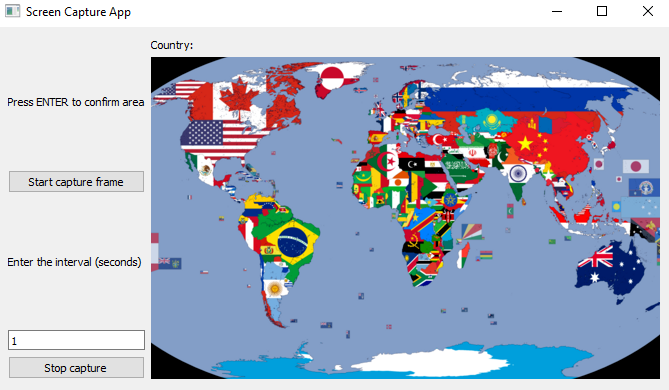

# Flag Classification with YOLOv8

This project shows how to perform flag classification using YOLOv8. In this repository, we provide a pre-trained YOLOv8 model trained on a dataset of flags from different countries and then use the geotastic website to detect the flag and point the country on the world map.

The model was trained to classify 231 countries based on their flags.


## Requirements

Before running the code, ensure you have the following dependencies installed:
- Python 3.10
- OpenCV
- NumPy
- ultralytics (YOLOv8 implementation)
- PyQT5 (Application for capture screen)

You can install the required dependencies by running:
```bash
pip install -r requirements.txt
```

## YOLOv8 Training
1. Clone the repository:
git clone https://github.com/lilmarcin/geotastic_with_AI.git
cd geotastic_with_AI

2. For new training download the pre-trained YOLOv8 model weights or use `yolov8n-cls.pt`.
https://docs.ultralytics.com/tasks/classify/

3. Prepare dataset with specific organization [Ultralytics prepare dataset](https://docs.ultralytics.com/datasets/classify/)

```bash
datasets/
|
|-- train/
|   |-- Afghanistan/
|   |   |-- Afghanistan001.png
|   |   |-- Afghanistan002.png
|   |   |-- ...
|   |
|   |-- Albania/
|   |   |-- Albania001.png
|   |   |-- Albania002.png
|   |   |-- ...
|   |-- ...
|
|-- test/
|   |-- Afghanistan/
|   |   |-- Afghanistan001.png
|   |   |-- Afghanistan002.png
|   |   |-- ...
|   |
|   |-- Albania/
|   |   |-- Albania001.png
|   |   |-- Albania002.png
|   |   |-- ...
|   |-- ...
|
|-- val/ (optional)
|   |-- Afghanistan/
|   |   |-- Afghanistan001.png
|   |   |-- Afghanistan002.png
|   |   |-- ...
|   |
|   |-- Albania/
|   |   |-- Albania001.png
|   |   |-- Albania002.png
|   |   |-- ...
|   |-- ...
|
```

4. Run notebook to start training: `training_yolov8.ipynb`. Remember to change paths and set parametetrs for training.
```python
model = YOLO("yolov8n-cls.pt")
model.train(data="datasets/", epochs=50)
```

5. Evaluate the trained model using `testing_yolov8.ipynb`.


## Usage application on [Geotastic](https://geotastic.net/highscore-hunt)

1. Run the App:
```bash
python ScreenCaptureApp.py
```


2. Click `Start capture frame` and select the area where the flags will appear. Next press ENTER to confirm area.


3. The App will output the predicted country based on the detected flag.


4. Enter the image refresh interval (in seconds). Default is 1 second.


5. Mark the predicted country on the map and click Finish Guess.


## Examples


## License

This project is licensed under the [MIT License](LICENSE).